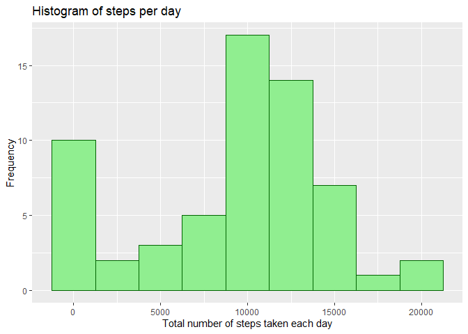

## The libraries that will be of support are loaded


```r
library(ggplot2)
library(dplyr)
```

```
## 
## Attaching package: 'dplyr'
```

```
## The following objects are masked from 'package:stats':
## 
##     filter, lag
```

```
## The following objects are masked from 'package:base':
## 
##     intersect, setdiff, setequal, union
```


## Loading and preprocessing the initialData

* 1. Load the initialData (i.e. read.csv())
* 2. Process/transform the initialData (if necessary) into a format suitable for your analysis


```r
unzip("activity.zip")
initialData <- read.csv("activity.csv", colClasses=c("numeric", "Date", "numeric"))
```


## What is mean total number of steps taken per day?


```r
total_steps <- initialData %>%
  group_by(date) %>%
  summarise(daily_steps = sum(steps, na.rm = TRUE))

ggplot(total_steps, aes(daily_steps)) + 
  geom_histogram(binwidth = 2500, col="darkgreen", fill="lightgreen") +
  ggtitle("Histogram of steps per day") +
  xlab("Total number of steps taken each day") + 
  ylab("Frequency")
```

<!-- -->


## What is the average daily activity pattern?


