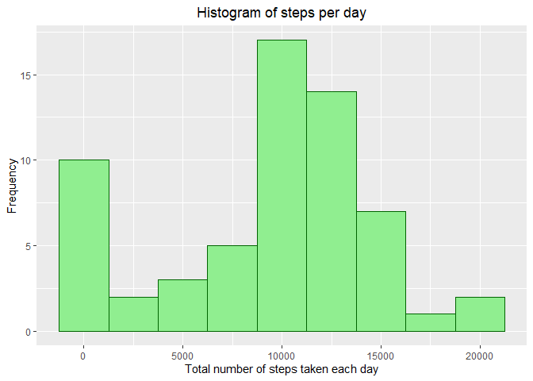
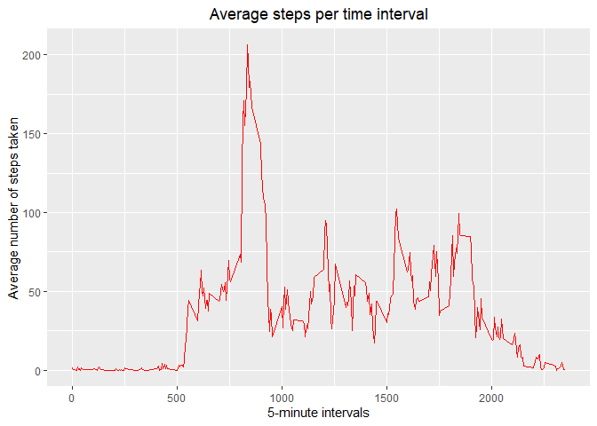

## The libraries that will be of support are loaded


```r
library(ggplot2)
library(dplyr)
```

```
## 
## Attaching package: 'dplyr'
```

```
## The following objects are masked from 'package:stats':
## 
##     filter, lag
```

```
## The following objects are masked from 'package:base':
## 
##     intersect, setdiff, setequal, union
```


## Loading and preprocessing the initialData

* 1. Load the initialData (i.e. read.csv())
* 2. Process/transform the initialData (if necessary) into a format suitable for your analysis


```r
unzip("activity.zip")
initialData <- read.csv("activity.csv", colClasses=c("numeric", "Date", "numeric"))
```


## What is mean total number of steps taken per day?


```r
total_steps <- initialData %>%
  group_by(date) %>%
  summarise(daily_steps = sum(steps, na.rm = TRUE))

ggplot(total_steps, aes(daily_steps)) + 
  geom_histogram(binwidth = 2500, col="darkgreen", fill="lightgreen") +
  ggtitle("Histogram of steps per day") +
  xlab("Total number of steps taken each day") + 
  ylab("Frequency") +
  theme( plot.title = element_text(hjust = 0.5))
```

<!-- -->


```r
mean = mean(total_steps$daily_steps, na.rm=TRUE)
```

```
## [1] 9354.23
```


```r
median = median(total_steps$daily_steps, na.rm=TRUE)
```

```
## [1] 10395
```

## What is the average daily activity pattern?


```r
interval_steps <- initialData %>% 
  group_by(interval) %>%
  summarise(steps = mean(steps, na.rm =TRUE))

ggplot(data=interval_steps, aes(x=interval, y=steps)) +
    geom_line(col="red") +
    ggtitle("Average steps per time interval") +
    xlab("5-minute intervals") +
    ylab("Average number of steps taken") +
    theme( plot.title = element_text(hjust = 0.5))
```

<!-- -->


## Imputing missing values

##### Calculate and report the total number of missing values in the dataset (i.e. the total number of rows with NAs)


```r
sum(is.na(initialData$steps))
```

```
## [1] 2304
```


```r
imputed_initialData <- initialData %>%
  mutate(
    steps = case_when(
      is.na(steps) ~ interval_steps$steps[match(initialData$interval, interval_steps$interval)],      
      TRUE ~ as.numeric(steps)
    ))


imputed_total_steps <- imputed_initialData %>% group_by(date) %>% summarise(daily_steps = sum(steps))

ggplot(imputed_total_steps, aes(daily_steps)) + 
  geom_histogram(binwidth = 2500, col="darkgreen", fill="lightgreen") + 
  ggtitle("Total number of steps taken each day") + 
  xlab("Total steps per day") +
  ylab("Frequency") +
  theme( plot.title = element_text(hjust = 0.5))
```

<!-- -->

##### We now compute the mean and median number of daily steps of the imputed initialData.


```r
imputed_mean = mean(imputed_total_steps$daily_steps, na.rm=TRUE)
```

```
## [1] 10766.19
```

```r
imputed_median = median(imputed_total_steps$daily_steps, na.rm=TRUE)
```

```
## [1] 10766.19
```
##### We can calculate the difference of the means and medians between imputed and original initialData.


```r
mean_diff <- imputed_mean - mean 
```

```
## [1] 1411.959
```

```r
median_diff <- imputed_median - median
```

```
## [1] 371.1887
```


